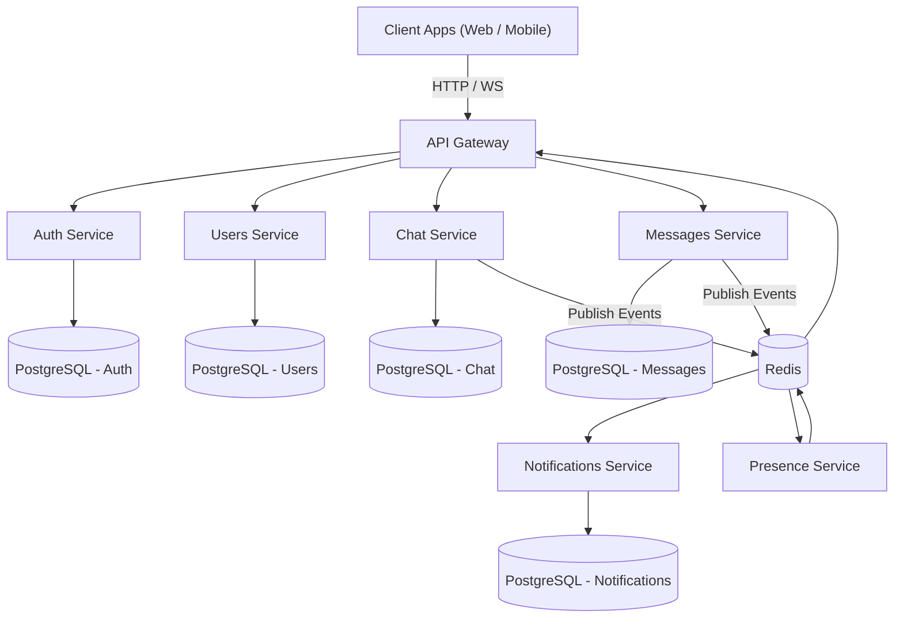
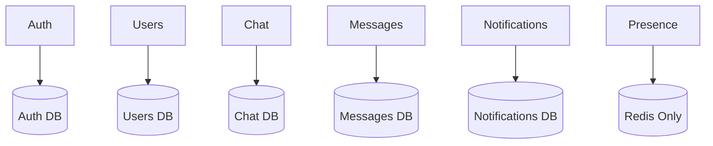
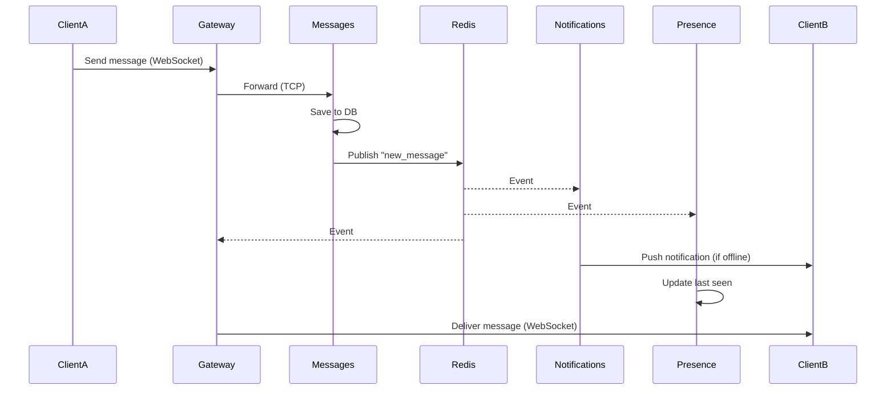

PROJECT STRUCTURE

 ```mermaid
 flowchart TD
    Root[whatsapp-clone]

    Apps[apps]
    Libs[libs]

    Root --> Apps
    Root --> Libs

    Apps --> Gateway
    Apps --> Auth
    Apps --> Users
    Apps --> Chat
    Apps --> Messages
    Apps --> Notifications
    Apps --> Presence

    Libs --> Common
    Libs --> Database
    Libs --> Redis
```

DATABASE STRATEGY


COMMUNICATION PATTERN

```mermaid
flowchart LR
    Gateway -->|Sync (HTTP/TCP)| Auth
    Gateway -->|Sync (HTTP/TCP)| Users

    Messages -->|Async (Pub/Sub)| Notifications
    Messages -->|Async (Pub/Sub)| Presence
    Chat -->|Async (Pub/Sub)| Messages
```

REAL-TIME MESSAGE FLOW

